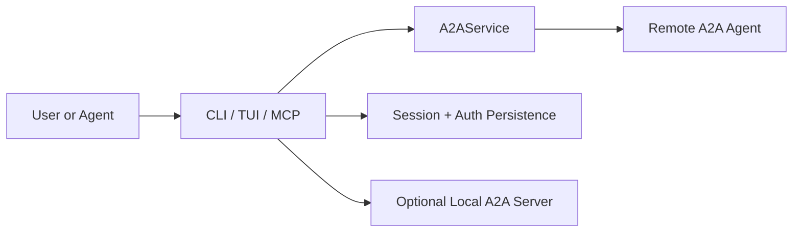
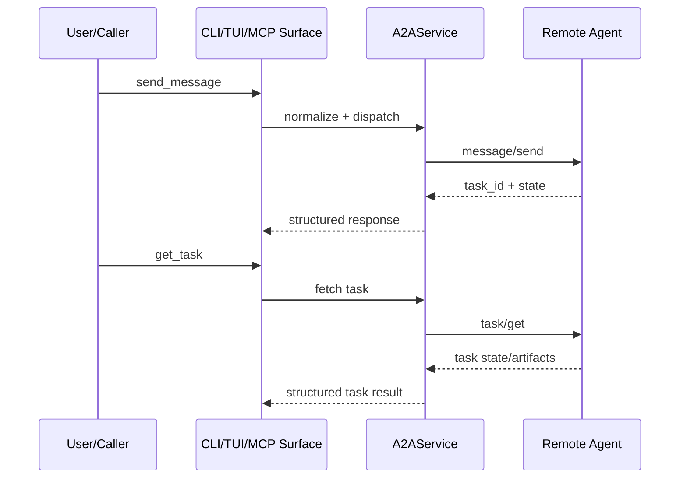
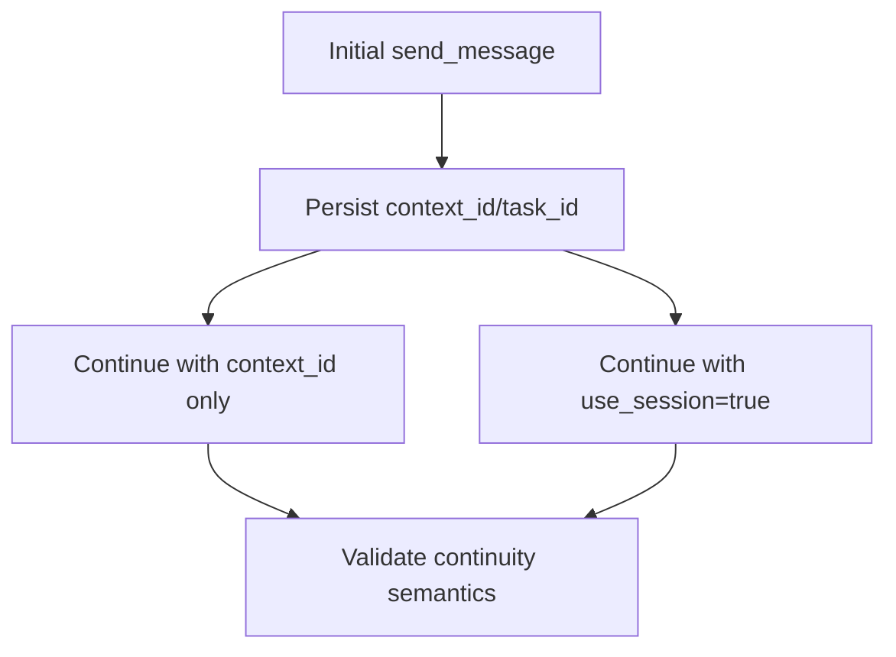
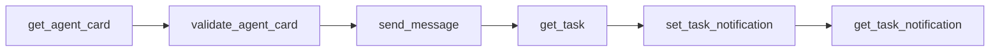

# Handler Diagram Templates

Use these templates after `exploring-handler-repository` identifies the requested flow.

## System Context

## Message Lifecycle

## Session Continuity

## MCP Tool Sequence

